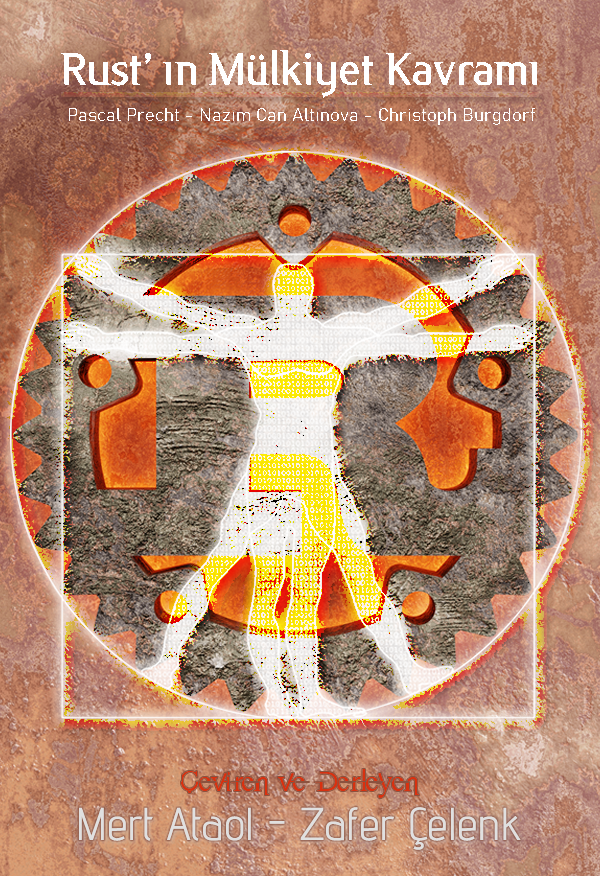

# Rust'ın Mülkiyet Kavramı

Rust programlama dilini diğer dillerden ayıran özelliklerin başında ownership, borrowing ve lifetime
yani dilimizdeki karşılıklarıyla **mülkiyet**​
, **borçlanma​** ve **yaşam**​ olan bu üç kavram geliyor.
Dilin temelini oluşturan bu üç kavramının bu dili kullanan programcılar için geleneksel programlama
yaklaşımını tamamen değiştirdiğini ifade edebiliriz. Öyle ki; diğer programlama dillerinin bakış
açılarına hakim olan programcıların mantıklı bulduğu kodlar Rust ile denendiğinde genellikle
çalışmaz.

Rust dilinde mülkiyet, öylesine önemli bir kavramdır ki, bu kavramı mümkün olduğunca erken
anlamak, derleyici hatalarını değerlendirmek ve dili daha çabuk kavramak açısından oldukça
yararlıdır. Ancak Rust’ın bu kavramları verilerin hafızada depolanma şekli ve hafıza güvenliği ile
doğrudan ilişkili olduğundan kavramların doğru ve tutarlı anlaşılabilmesi için öncelikle bu konuları
incelenmesi oldukça önemlidir.

## Hafıza Güvenliği

Rust'ın bir programlama dili olarak öne çıkmasının önemi tartışılırken, bellek güvenliğinin aslında ne
anlama geldiğini anlamak gereklidir. Özellikle, sistem programcılığına uygun olmayan veya
çoğunlukla çöp toplama mekanizmasına sahip dillerden edinilen tecrübeler ışığında Rust'un bu
temel özelliklerinin ayırdına varmak biraz zor olabilir.

Will Crichton'ın, **Rust' ta Bellek Güvenliği: C ile Bir Örnek Çalışma​** adlı önemli makalesinde
belirtildiği gibi: “Hafıza güvenliği, kullanılan işaretçilerin daima doğru tür/boyutta tahsis edilen geçerli
hafızaya işaret ettiği bir programlama özelliğidir. Güvensiz hafızaya sahip bir program hatalarına
bağlı olarak teknik olmayan çıktılar üretebileceği ya da kendiliğinden çökebileceğinden, hafıza
güvenliği bir doğruluk sorunudur.”
Haliyle bu ifadeden, uygulamada "hafıza güvenliği sunmadan" kod yazılmasına izin veren
programlama dillerinin varlığını öğreniyor ve güvensiz hafıza kullanımına yol açan hataları
tanımanın da kolay olduğunu anlıyoruz.

**Dangling Pointers:​** Geçersiz ya da silinmiş verileri gösteren işaretçiler. (Bu türden sorunlarla
karşılaşıldığında verinin bellekte nasıl depolandığına bakılması mantıklı olacaktır. [Daha fazla bilgi için](https://stackoverflow.com/questions/17997228/what-is-a-dangling-pointer)

**Double frees:** Aynı hafıza bölgesini iki kere boşaltmaya çalışarak ​ tanımsız davranış​ lara yol açmak
[Daha fazla bilgi için​](https://stackoverflow.com/questions/21057393/what-does-double-free-mean)

Güvensiz hafızaya yol açan hatalardan bazılarıdır. ​ Dangling pointer​ kavramını izah edebilmek için
aşağıda bulunan D kodunun hafızada nasıl temsil edildiğini inceleyelim.

```d
string s = "Have a nice day";
```

Dizgi olarak ilklendirilen bir değişkenin bellekte kullandığı stack ve heap bölümleri aşağıdakine
benzer biçimde gösterilir.

```bash
                      buffer
                    /   capacity
                  /   /    length
                /   /    /
            +–––+––––+––––+
stack frame │ • │ 16 │ 15 │ <– s
            +–│–+––––+––––+
              │
            [–│––––––––––––––––––––––––– capacity ––––––––––––––––––––––––––]
              │
            +–V–+–––+–––+–––+–––+–––+–––+–––+–––+–––+–––+–––+–––+–––+–––+–––+
        heap │ H │ a │ v │ e │   │ a │   │ n │ i │ c │ e │   │ d │ a │ y │   │
            +–––+–––+–––+–––+–––+–––+–––+–––+–––+–––+–––+–––+–––+–––+–––+–––+

            [––––––––––––––––––––––––– length ––––––––––––––––––––––––––]
```

Heap ve stack kavramlarının ne olduğuna gelmeden önce stack üzerinde depolanan verinin üç
kelimeden oluşan sabit boyutlu bir string nesnesi olduğunu bilmek önemlidir. Aşağıdaki alanlar ise
asıl verileri, arabellek kapasitesini, metnin uzunluğunu tutan ve heap tarafından ayrılan arabellek
için bir işaretçidir. Başka bir deyişle arabelleğinin sahibi **s adındaki**​ string nesnesidir. Bu nedenle
nesne program tarafından yok edildiğinde, string boyutu kadar tamponlanmış olan belleği de
türünün kendi yıkıcısı tarafından serbest bırakılacaktır.
Bununla birlikte, aynı tampon belleğe referans veren başka işaretçiler de olabilir. Nesnenin
yıkılmasıyla boşaltılan ve artık hafızada bulunmayan bu tampon belleğe halen işaret etmekte olan
bu işaretçilere **dangling pointers**​ adı verilmektedir.

Bu tür sorunlar bünyelerinde bulundurdukları çöp toplayıcı mekanizmaları sayesinde D ve go gibi yeni nesil dillerde ciddi sorunlara yol açmazlar. Bu tür programların çöp toplama mekanizmaları, programın işleyişi boyunca artık kullanılmayan ve hafızaya geri verilmesi gereken her şeyi çalışma zamanında otomatik olarak tespit edip sisteme geri iade ederler.  
Bir programlama dilinin bu tür bir mekanizmaya sahip olması şirin görünse bile, çöp toplama süreçlerinin derleme zamanında gerçekleştiriliyor olması, programın çalışma zamanı ve performansını etkiler.

Rust hafıza güvenliğini garanti altına almak için çöp toplama mekanizması kullanmak yerine  mülkiyet ve borçlanma sistematiği üzerinden bu sorunu çözüyor. O nedenle Rust dilinde hafıza güvenliğinden söz edildiğinde, bellek korumalı olmayan bir kodun yazılmasına derleyici tarafından izin verilmediği anlatılmak istenir.

## Hafızanın Bölümleri: Stack ve Heap

Rust' un mülkiyet kavramını ele alış şekline girmeden önce, hafızanın stack ve heap olarak adlandırılan bölümlerinin ne olduğuna ve bu bölümlerde ne tur verilerin nerede depolandığına hızlı bir şekilde göz atalım. Aynı belleğin parçaları olmalarına rağmen stack ve heap farklı veri yapılarıyla temsil edilirler. Hafızada verilerin girildiği sırayla depolandığı ancak ters sırada kaldırıldığı (lifo:  last in first out) ve çok hızlı çalışan bölümüne stack adı verilirken, okuma ve yazma için daha fazla hesaplama gerektiren  ve bir ağaç yapısını andıran bölümüne de heap adı verilir.

Hafızanın bu bölümlerinde neler olduğu ise üzerinde çalışılan verilerle ilgilidir. Rust’ ta tam sayılar, kayan noktalı sayılar, işaretçi tipleri gibi boyutları sabit ya da derleme zamanında bilinen türler stack bölümünde depolanır. Derleme zamanında boyutları dinamik olarak değişebilen ya da hiç bilinmeyen türler ise silinirlerken özel bir temizlik çalışması gerektirdiğinden heap bölümüne konulur.
O nedenle önceki örnekte bulunan string nesnesinin kendisi; kapasite, uzunluk ve ara bellek işaretçi değerleri değişmez ve sabit boyutta olduğundan stack üzerinde, sahip olduğu ham verileri için kendisine ayrılan ara bellek ise heap üzerinde depolanır. D gibi programlama dillerinin çoğunda hafıza işlemleri bu şekilde yürütülürken Rust heap bölümünde veri depolamaktan kaçınır ve mülkiyet kavramı konusunda da ele alınacağı gibi Box gibi belirli işaretçi türlerini kullanıma sokar.

## Mülkiyet Kavramını Anlamak

Çöp toplayıcısına sahip olmayan düşük seviyeli dillerde değişkenler için ayrılan kaynakların hafızaya iade edilmesinden programcının kendisi sorumludur. Programın akışı içerisinde programcı, işlemlerinde kullandığı kaynaklarla işini bitirdiğinde  ya da programın o kaynağa ihtiyacı olmadığını düşündüğünde kaynağı serbest bırakarak kullanılan bellek alanını iade etme yolunu seçer. C dilinde işaretçi kullanılarak böyle bir örnek verilmek istendiğinde şu şekilde bir kodun yazılması gerekir.

```c
    int main(int argc, const char * argv[]) {
        char *str;
        str = (char *) malloc(10); // Bellekte 10 birimlik yer ayırıyoruz.
                              // str ile bir takım işlemler...

        free(str); // str pointer'ını ve kullandığı kaynağı serbest bırakıyoruz.

        return 0;
    }
```

Bu basit örnekte; str adında bir char işaretçisi tanımlanarak ona hafızadan 10 birimlik bellek alanı ayrılmış, kodun str işaretçisine ihtiyaç duyulmayan bölümüne gelindiğinde free() işlevi yardımıyla ayrılan o kaynak sisteme geri verilmiştir.

Normal görünen bu kodda yer alan iade işleminin herhangi bir nedenle unutulması ayrılan kaynağın programı işleten sisteme geri verilmemesine neden olur ve bu kaynak sistem yeniden başlatılana kadar hafızada kalmaya devam eder. Böyle bir durumda hafızanın kullanılan o bölümü süreç boyunca sistem ihtiyaçları için kullanılamayacağından program bellek sızıntısı olarak tanımlanan soruna neden olacaktır.

Bu sorun iade edilmesi gereken bellek miktarı arttıkça ciddi oranda kaynak savurganlığına neden olacak, performans kaybından programın donmasına kadar giden sorunları beraberinde getirecektir.
Çöp toplayıcısı olan dillerde ise bu sorun otomatik süreçler tarafından yönetilip yürütüldüğünden programlama sürecinde büyük bir dikkat ve hassasiyet gerektirmez.

Toparlarsak programlama dillerinin bazıları çalışabilmeleri için sistemden aldıkları kaynakların geri verilmesi sorumluluğunu programcıya, bazıları otomatik mekanizmaları aracılığıyla kendi sorumluluğunda bulunan çöp toplayıcı mekanizmalarına verirken; Rust bu sorumluluğu mülkiyet kavramı üzerinden hafızayı elinde tutanın sorumluluğuna bırakılmıştır.

Yani bu Rust’ın bir çöp toplama mekanizmasının bulunmadığı gibi, bellek yönetimi konusunda da programcısını zorlamadığı anlamına gelir.  Rust bellek yönetimi ve güvenliğini hiç bir çöp toplama mekanizmasına ihtiyaç duymadan mülkiyet kavramı içinde kümelediği kurallar aracılığıyla sağlar.

Bir nesnenin sahibi olmak, o nesnenin yaşam hakkının yalnızca sahibinin elinde olduğu anlamına gelir.

## Yaşam Alanı ve Süresi

Rust dilinde bazı değişkenler tanımlandıkları sırada hiçbir kaynağa sahip değillerken, sistemden alınmış bulunan her kaynağın sadece bir sahibi bulunur. Benzer şekilde bir değerin sahibine mülkiyeti bıraktırıldığında Rust jargonuyla düşürüldüğünde sahip olunan değer de düşürülür. Daha da ilginci değişkenin bildirildiği bir blok kapsamı, bir işlev, bir if ifadesi veya süslü parantezler arasında sunulan bir kod bloğu vb. Sonlandırıldığı anda hem değişken hem de içeriğindeki değer düşürülür.

```rust
fn selamla() {
  let baglam = "İyi günler dilerim".to_string();
  println!("{}", baglam); // `baglam` değişkeni de burada düşürülür.
}
```

Yukarıdaki örneğe bakıldığında, işlev bloğunun sonuna gelindiğinde s değişkeni değerinin düşürüleceğini bildiğimizden, değişkenin yaşam alanını net biçimde gözlemleyebiliyoruz. Bu durum daha karmaşık veri yapılarında da aynen geçerlidir.

```rust
let names = vec!["Pascal".to_string(), "Christoph".to_string()];
```

Bu örnek kod ile names adında bir vektör oluşturulmuştur. Rust’ın vektörleri dizi veya listelere benzemekle beraber boyutları dinamik olarak değişebildiğinden push() işlevi yardımıyla çalışma zamanında değer kabul edebilirler. Örneğin kullandığı hafıza aşağıdaki gösterime benzer.

```bash
[–– names ––]
            +–––+–––+–––+
stack frame │ • │ 3 │ 2 │
            +–│–+–––+–––+
              │
            [–│–– 0 –––] [–––– 1 ––––]
            +–V–+–––+–––+–––+––––+–––+–––+–––+
       heap │ • │ 8 │ 6 │ • │ 12 │ 9 │       │
            +–│–+–––+–––+–│–+––––+–––+–––+–––+
              │\   \   \  │
              │ \   \    length
              │  \    capacity
              │    buffer │
              │           │
            +–V–+–––+–––+–––+–––+–––+–––+–––+
            │ P │ a │ s │ c │ a │ l │   │   │
            +–––+–––+–––+–––+–––+–––+–––+–––+
                          │
                          │
                        +–V–+–––+–––+–––+–––+–––+–––+–––+–––+–––+–––+–––+
                        │ C │ h │ r │ i │ s │ t │ o │ p │ h │   │   │   │
                        +–––+–––+–––+–––+–––+–––+–––+–––+–––+–––+–––+–––+
```

Daha önceki string nesnesine benzer şekilde kapasitesi, uzunluğu ve vektöre ait ham verilerinin bulunduğu heap konumu gösteren işaretçisi ile vektör nesnesinin kendisi stack üzerinde depolanırken, vektöre ait ham verilerin oluşturduğu string nesnelerinin kendi tampon bellekleri ile ve sırasıyla heap üzerinde depolanır. Bu şekilde her değerin tek bir değişkene ait olduğu veri ağacı yapısı oluşturularak, names vektöründeki her bir öğenin kapsam dışına çıkıldıkça değerlerinin ve kullandıkları ara belleklerinin düşmesi sağlanmış olur.

## Move

Stack üzerinde depolanan integer bool, char gibi ilkel türler haricinde bir heap üzerinde depolanan kaynaklara sahip olan her nesne, bir diğerine atama yoluyla ya da bir işleve parametre olarak aktarıldığında o kaynağın mülkiyeti de aktarılmış sayılır. Bu duruma Rust terminolojisinde move yani taşıma adı verilir. Ve bir kaynak taşındığında kaynağın bir önceki sahibi artık kullanılamaz hale geleceğinden silinir. Böylelikle halihazırda silinmiş olan bir kaynağın referans verilerek kullanılmasının önüne geçilmiş olunur. 
Bu noktada nesnenin atanma ya da parametre yoluyla işleve geçirilmesi gibi işlemlerde stack üzerinde depolanan türler kopyalanırken heap üzerinde depolanan türler ise taşınır. Bu durum Rust diliyle kod üretimini etkilediği için oldukça önemlidir.

```rust
fn islev(x: i32, y: i32) {
    println!(“İşlevden dönen değerler x: {}, y: {} “, x, y);
}

fn main() {
    // Stack allocated integer değeri
    let x = 5i32;

    // kaynağı taşınmadan x değişkeni y değişkenine kopyalanıyor.
    let y = x;

    islev(x, y);

    // İki değişken de birbirinden bağımsız olarak halen kullanılabilir.
    println!("x değişkeni: {}, ve y değişkeni {}", x, y);
}
```

Yukarıdaki örnek x değişkeninde tutulan ilkel bir tür olan integer değeri diğer programlama dillerine benzer şekilde kopyalanırken aşağıdaki örnekte yer alan a değişkeni heap üzerinde depolanan bir değere sahip olduğu için atama işlemin gerçekleştiğinde mülkiyeti de taşınacak, mülkiyetinde bulunan hafiza kaynağı ise, mülkiyeti devralan b değişkenine aktarılacağından, a değeri silinerek kullanılamaz duruma gelecektir.

```rust
fn main() {
    // a bir heap allocated integer değeri işaret eder.
    let a = Box::new(5i32);
    println!("a: {}", a);
// a değişkenini b'ye taşıyoruz. Bu andan sonra a kullanım dışı olacak. 
// Eğer bu noktadan sonra a'yı kullanmaya çalışırsak derleyici 
// use of moved value hatası üretecek.
    let b = a;    // a değişkeninin sahip olduğu değer için ayrılmış kaynak
// artık b’ye taşındığından bu noktadan sonra a artık kullanılamaz

   println!("b'nin taşıdığı değer: {}", b); // Sorunsuz çalışacak
   println!("a'nın taşıdığı değer: {}", a); // Bu satır hata üretilmesine neden olur
}
```

Aşağıdaki örnek main işlevi içinde farklı yapı türleriyle kullanılmak istenilen bir değişkenin yaşamını mülkiyet aktarımı nedeniyle nerelerde sürdüğünü ve değişkenin hangi noktada kullanılamaz hale gelerek kullandığı hafıza kaynağını sisteme geri iade ettiğini anlatır.

```rust
struct Config {……}
struct ProductService {……}
struct BasketService {……}

fn main() {
    let config = Config { debug_mode: true };
    // Bu noktada config `main` işlevine aittir.
    // Bu main işlevinin sonunda hafızanın 
    // serbest bırakılacağı anlamına gelir

    let product_service = ProductService::new(config);
    // Bu noktada config `new` işlevinin mülkiyetine girer
    // Yani main işlevi artık `config` değişkenine sahip olmadığından
    // `config` değişkeninin kullanılmasına artık izin verilmez. 

    let basket_service = BasketService::new(config);
    // config değişkeni `main` işlevinin mülkiyetinde olmadığından 
    // BasketService’e ait olan new işlevinde de kullanılamaz.
}
```

Yorum satırları dikkatle okunduğunda akıllara config değişkeninin neden main işlevinin son satırına kadar kullanılamadığı sorusu gelebilir.  Bunun yanıtı config değişkeni değeri için bellekte ayrılan tüm kaynağı ProductService yapısının new işlevine işlev parametresi olarak geçirilmesinde gizlidir.

Mülkiyetin new işlevine geçirilmesiyle artık kaynağın yeni sahibi olan new işlevinin o mülkiyetle ne yapacağı tamamen kendisini ilgilendirir. Mülkiyeti elinde bulunduranın sahip olduğu şeyi imha etme hakkına da sahip olduğunu bildiğimizden, ancak yeni sahibin hafızayı boşaltma kararı verip vermediği bilgisine sahip olmadığımızdan dolayı böyledir.

Mülkiyetin ve üzerindeki tüm tasarrufun başka bir servise aktarıldığı bir bellek alanının başına neyin geldiği bilinmeden başka servislerce de kullanılmasına izin verilmesi korkunç veri kayıplarına neden olabileceğinden Rust derleyici olası bir çalışma zamanını önlemiş olur  
Heap üzerinde depolanan kaynaklara sahip olan değişkenler parametreleri yoluyla işlevlere geçirildiklerinde sadece o işlevin kod blokları arasında yaşarlar. Doğal olarak taşıdığı değer için ayrılmış kaynakları işleve aktarılan değişken de bir daha kullanılamayacağından silinir.

```rust
// Aşağıdaki işlev parametre yoluyla kendisine geçirilen a değişkeni için
// ayrılan kaynakların mülkiyetini de alacağından işlevin bitiminde
// c’nin kaynakları da sisteme iade edilecek

fn box_sil(c: Box<i32>) {
    // <-mülkiyet devralan C değişkeni yaşamaya başlar

println!("İşlevin kapsamı boyunca c istenildiği gibi kullanılır: {}", c);

}    // <-C değişkeninin yaşam alanı bu noktada sonlandığından
// c değişkeni silinerek taşıdığı kaynak sisteme iade edilir.

fn main() {
    let a = Box::new(5i32);
    println!("a: {}", a);

    box_sil(a);    // <- a değişkeninin tuttuğu değer için hafızada ayrılan
// kaynağın mülkiyeti işleve devredildiğinden
// a değişkeni bu noktadan sonra kullanılamaz
    println!("a’nın sahip olduğu kaynak taşındığından hata üretilir: {}", a); 
}    // <- Eğer a değişkenin sahip olduğu kaynak  box_sil işlevine 
    // aktarılmamış olsaydı a değişkeni yaşam alanı bu noktada sona erecekti
```

## Borçlanma

Başka programlama dillerine aşina olanlar böyle bir kod tasarımıyla ilk karşılaştıklarında name, a ve b değişkenlerinin her birinin “Pascal” çıktısını üreteceğini tahmin edeceklerdir.

```rust
let name = "Pascal".to_string();
let a = name;
let b = name;
```

Ancak bu kod Rust derleyicisine gönderildiğinde durumun böyle olmadığı anlaşılacaktır.  

```bash
error[E0382]: use of moved value: `name`
 --> src/main.rs:4:11
  |
2 |   let name = "Pascal".to_string();
  |       ---- move occurs because `name` has type `std::string::String`, which does not implement the `Copy` trait
3 |   let a = name;
  |           ---- value moved here
4 |   let b = name;
  |           ^^^^ value used here after move
```

Ürettiği oldukça faydalı hata açıklamasında derleyici, name adlı string türündeki değişken içeriğinin a değişkenine taşındıktan sonra b değişkenine de atanmaya çalıştığını ve bu durumun hataya neden olduğunu söyler. Buradaki sorun b değişkenine atanmak istenen isim değişkeninin mülkiyetinin başka bir değişkene aktarılması ve  artık bir değere sahip olmamasıdır. Neler olup bittiğini daha iyi kavrayabilmek için bellekte neler olduğunu anlamakta yarar var. Name değişkeni ilklendiğinde hafızadaki durumu aşağıdaki gibi temsil edilmektedir.

```bash
            +–––+–––+–––+
stack frame │ • │ 8 │ 6 │ <– name
            +–│–+–––+–––+
              │
            +–V–+–––+–––+–––+–––+–––+–––+–––+
       heap │ P │ a │ s │ c │ a │ l │   │   │
            +–––+–––+–––+–––+–––+–––+–––+–––+

Ancak name değişken değeri a değişkenine atandığında mülkiyeti a değişkenine aktarılmış olduğundan name değişkeni ilklendirilmeden bırakılmış olur. 
 [–– name ––] [––– a –––]
            +–––+–––+–––+–––+–––+–––+
stack frame │   │   │   │ • │ 8 │ 6 │
            +–––+–––+–––+–│–+–––+–––+
                          │
              +–––––––––––+
              │
            +–V–+–––+–––+–––+–––+–––+–––+–––+
       heap │ P │ a │ s │ c │ a │ l │   │   │
            +–––+–––+–––+–––+–––+–––+–––+–––+
```

Böyle bir durumda b = name; ifadesinin sürpriz şekilde hatayla sonuçlanmasına şaşırmak yerine, derleyicinin bu kodu daha çalıştırılmadan önce statik olarak analiz etmesine odaklanmak önemlidir. Rust derleyicisi güvensiz kod yazılmasına izin veren derleyicilerden değildir:-)

Ancak derleyicinin bu tutumu değişkenler aracılığıyla birden fazla noktada aynı verilere ulaşılması gerektiğinde maliyetli çözümleri de beraberinde getirir. Böyle bir durumla başa çıkmanın kolay ama pahalı bir yolu değişkene ait olan değeri kopyalamak ya da klonlamak olacak, ancak bu tercih bellekteki verilerin de çoğalacağı anlamına gelecektir.

```rust
let name = "Pascal".to_string();
let a = name;
let b = a.clone();
```

Yukarıdaki örnekte isim değişkeni a değişkenine atandıktan sonra kendisinden bir değer elde edilemeyeceğinden klonlamanın yeni atanan a değişkeni üzerinden yapıldığına dikkat edilmelidir.  Program çalıştığında bellekteki veriler düşürülmediği sürece aşağıdakine benzer şekilde temsil edilirler.

```bash
[–– name ––] [––– a –––][–––– b ––––]
            +–––+–––+–––+–––+–––+–––+–––+–––+–––+
stack frame │   │   │   │ • │ 8 │ 6 │ • │ 8 │ 6 │
            +–––+–––+–––+–│–+–––+–––+–│–+–––+–––+
                          │           │
              +–––––––––––+           +–––––––+
              │                               │
            +–V–+–––+–––+–––+–––+–––+–––+–––+–V–+–––+–––+–––+–––+–––+–––+–––+
       heap │ P │ a │ s │ c │ a │ l │   │   │ P │ a │ s │ c │ a │ l │   │   │
            +–––+–––+–––+–––+–––+–––+–––+–––+–––+–––+–––+–––+–––+–––+–––+–––+
```

Açıkçası verileri klonlamak, uğraşılan verilere bağlı olarak fazla bellek gerektiren pahalı bir işlemdir. Oysa bu senaryoda gerekli olan tek şey bir değere referans vermektir. Bu tür bir yönelim ise özellikle bir değere sahip olmanız gerekmeyen işlevleri yazarken oldukça kullanışlıdır. Kendisine verilen ismi kullanarak selamlama işlevini yerine getiren aşağıdaki gibi bir örnek hayal edelim:

```rust
fn greet(name: String) {
  println!("Hello, {}!", name);
}
```

Bu işlev kendisinin aynı değişkenle defalarca çağrılmasını önlediği gibi, kendisine geçirilen değerin mülkiyetine de gerek duymaz:

```rust
let name = "Pascal".to_string();
greet(name);
greet(name); // name değişkeni daha önce taşınmış olduğundan derlenmeyecek
```

Bir değişkenin referansını almak için & sembolünü kullanılır. Ve bu sembol kullanıldığında bir değer üzerinden referans beklendiği açıkça anlaşılır.

Genellikle bu türden API’ler farklı nedenlerden dolayı &str şeklinde daha genel amaçlara yönelik tasarlanmakla birlikte bu aşamada sadece &String’ e ihtiyaç duyulduğundan aşağıdaki şekilde tasarlanmıştır.

```rust
fn greet(name: &String) {
  println!("Hello, {}!", name);
}
```

İşlev şimdi bir string referansı beklediğinden yapılan bu değişiklik onun defalarca çağrılabilmesine neden olur. 

```rust
let name = "Pascal".to_string();
greet(&name);
greet(&name);
```

Örnekteki işlev gibi, bir değerin referansını bekleyen işlevler kendilerine aktarılan değerleri sadece *ödünç almış olduklarından o değerlere hiçbir zaman sahip olmazlar.

Artık değişkenleri birden fazla noktada aynı verilere ulaşabilecek şekilde değerlendirebiliriz.

```rust
let name = "Pascal".to_string();
let a = &name;
let b = &name;
```

Yukarıdaki kodda a ve b değişkenleri name değişkeni değerini referans gösterirken name değişkeni değerinin mülkiyetini hiçbir zaman kaybetmez. Aşağıdaki kod da aynı şekilde değerlendirilir. 

```rust
let name = "Pascal".to_string();
let a = &name;
let b = a;
```

Artık aşağıdaki atamaları gerçekleştirerek greet() işlevini çağırmak bir soruna yol açmaz.

```rust
let name = "Pascal".to_string();
let a = &name;
greet(a);

let b = a;
greet(a);
```

## Referans ve Borçlanma

Verileri hafızanın heap bölümünde depolanan bir değişkene ait kaynakların, atandığı başka bir değişkenin mülkiyetine aktarılıyor olması ve bu nedenle düşürülen bir önceki değişken ve kaynaklarına bir daha erişilemiyor olması olumsuz bir özellikmiş gibi görünüyor olabilir. Bir işleve parametre yoluyla geçirilen değişkenlerin programın ilerleyen bölümlerinde bir daha kullanılamıyor olması ise oldukça can sıkıcıdır. Değişkenin mülkiyeti devredilmeden sadece verisine erişilmek istenen bu gibi durumlarda  Rust’ ın borçlanma mekanizmasından yararlanılır.

Bir değişkenin referansı; o değişkenin sahip olduğu verinin kendisi yerine bellekteki adresini gösterdiğinden, nesnenin kendisi yerine referansının kullanılarak işlenmesine borçlanma adını veriyoruz.
Bir nesnenin referansı işlendiği sürece düşürülmemesi; program derlenmeden önce Rust’ ın dahili **Borrow Checker** adlı mekanizması tarafından referansların geçerliliği kontrol edilerek sağlanır.

```rust
fn main() {
    // Box içinde bir integer oluşturuyoruz.g
    let boxed_int = Box::new(5);
    let ref_int = &boxed_int; // '&' ile referans oluşturuyoruz.

    println!("değişken: {}, referansı: {}", boxed_int, ref_int);
}
```

Bir değişkenin başka bir değişkene atanması ya da parametre yoluyla bir işleve geçirilmesi esnasında kullanılan & sembolü o değişkenin sadece referans verilmesine neden olacağından yukarıdaki örnekte yer alan boxed_int ve ref_int değişkenlerinin her ikisi de kullanılabilir durumdadırlar. Aşağıdaki örnekte bir vektörün referans yoluyla işlev parametresine geçirilmesi irdelenmektedir.

```rust
fn foo(v1: &Vec<i32>) { // <--- '&Vec' Parametre bir referanstır
    println!("referans vektör: {:?}", v1);
}

fn main() {
    let v1 = vec![1, 2, 3]; // Vektörlerin ham verileri hesap üzerinde depolanır.
    foo(&v1); // foo işlevine referans olarak v1'i gönderildi.
    println!("vektörün kendisi: {:?}", v1); // Vektör halen kullanılabilir haldedir.
}
```

Bir kaynağın referansından önce silinmesi referansın artık null bir alanı göstermesine neden olacağından böyle bir duruma Rust’ın statik olarak çalışan Borrow Checker mekanizması tarafından izin verilmez.

```rust
fn foo(v1: Vec<i32>) { // <- İşlev normal bir vektör değeri beklediğinden
    println!("fonksiyondaki vektör: {:?}", v1);
}

fn main() {
    let v1 = vec![1, 2, 3];
    let referans_vec = &v1;

    foo(v1); // <-'ödünç alınmış bir değişken taşınamaz' hatası üretecektir!
}  
```

Ancak referansın düşürülmesi veya yıkılmasıyla borçlanma da ortadan kalkmış olacağından aşağıdaki işlev beklendiği gibi çalışacaktır.

```rust
fn foo(v1: Vec<i32>) { // <- İşlev normal bir vektör değeri beklediğinden
    println!("İşlevdeki vektör: {:?}", v1);
}
fn main() {
    let v1 = vec![1, 2, 3];

    { // <- Anonim bir blok açıyoruz
        let referans_vec = &v1;
    } // <- Bir değişkenin ömrü sadece bulunduğu blok içinde anlamlı
    // olduğundan kapanan parantez ile verilen referans yıkılmış olur.

    foo(v1); // <- Artık nesnenin bir referansı olmadığından işlev çalışır.
}
```

Referansın isimsiz bir işlev içinde yaratılıp işlev sonlandığında kendiliğinden yıkılması ve foo() işlevinin çağrıldığı kod uzayında v1 vektörüne verilen bir referansın bulunmaması nedeniyle vektörün mülkiyeti sorunsuz şekilde işleve aktarılacaktır.

Rust değiştirilemez olarak bağlanmış bir değişkenin değişebilir bir referansının oluşturulmasına izin vermez. Bununla birlikte değişebilir olarak tanımlanmış değişkenlerin &T yerine &mut T şeklinde değişebilir olarak bildirilmiş referanslarını da kabul eder.

```rust
fn main() {
    let mut x = 5;

    {
        let y = &mut x; // değişebilir değişkenin değişebilir referansı.
        *y += 1;  // Referansın gösterdiği kaynak arttırılır.
    }

    println!("{}", x); // Değişken değeri 6 olduğundan '6' çıktısı verecektir.
}
```

Örnekte olduğu gibi let anahtarıyla tanımlanmış bir değişkene değişebilir bir değişkenin referansı geçirilirken **let y = &mut x;** atanan değişkenin de mutable olarak bildirilmesi gerekmez. Rust derleyicisinin tür çıkarsama mekanizması eşitliğin sağ tarafına bakarak çıkarımını gerçekleştirdiğinden bunu gereksiz kılar. Ancak mutable olarak borç alınmış bir değişkenin referansının **let y = &x;** şeklinde değişmez olarak bildirilmesi *y += 1 değişmez olarak borçlanılmış değişkene bir değer atanıyor hatası döndürecektir. Borç alınan değişken x’in let mut x = 5; şekilde tanımlanmamış olması da immutable değişkenin mutable olarak referansı alınıyor hatası ile sonuçlanır.

Mutable olsun olmasın bir değişkeninin verileri, değişken ödünç alındığında dondurulur. Donmuş veriler bütün referanslar kapsam dışına çıkana kadar orjinal nesne üzerinde değişmez olarak korunur.  Bu işleme **freezing** adı verilir.

```rust
fn main() {
    let mut sayi = 7i32;

    {
        // 'sayi' ödünç verildiğinde referans kapsamı da başlıyor.
        let ref_sayi = &sayi;

        sayi = 50; // <- Bu satır, sayı değişkeni referans alındığı için 
  // hata üretecektir.
    } // <- Referans kapsamından çıkıyor.

    sayi = 3; // <- Referansı kalmayan mutable değişken değiştirilebilecektir.
}
```

## Ref Kalıbı

Rust’ ta referansları oluşturmanın bir başka yolu da ref anahtar kelimesini kullanmaktan geçer.

```rust
fn main() {
    let sayi = 10;

    let ref ref_sayi1 = sayi;
    let ref_sayi2 = &sayi;
}
```

Ampersand sembolü kullanılarak alınan referans ile yukarıdaki örnekte kullanılan referans kalıbı arasında hiçbir fark olmamakla birlikte ref kalıbı yapısal programlamada işleri biraz daha kolaylaştırmak için kullanılır.

```rust
struct Point { x: i32, y: i32 }

fn main() {
    let nokta = Point { x: 0, y: 0 };

    let x_in_kopyasi = {
        // 'x_referansi' değişkeni, 'nokta' adlı struct'ın x değerini tutuyor.
        let Point { x: ref x_referansi, y: _ } = nokta;

        // 'x_referansi' değerini döndürerek x değişkeninin kopyası oluşturulur.
        *x_referansi
    };
}
```

Yukarıdaki örnekte Point adındaki yapıdan elde edilen nokta nesnesinin x adlı üyesinin değerini bir kapama işlevi yardımıyla ref kalıbı kullanılarak  x_in_kopyasi adlı değişkene kopyalanıyor.  Bu referans kalıbı yapılarla çalışırken olduğu gibi, çokuzlular ile çalışırken de  Tuple içindeki değerlerin  referanslarını almak için oldukça kullanışlıdır.

```rust
fn main() {
    let mut mutable_tuple = (5, 3);

    {
        // İkinci elemanını mutable referans olarak almak için tuple'ı parçalıyoruz.
        let (_, ref mut ikinci) = mutable_tuple;
        *ikinci = 2; // İkinci elemanının değerini değiştiriyoruz.
    }

    println!("Tuple: {:?}", mutable_tuple); // Çıktı "Tuple: (5, 2)" olacaktır.
}
```

Bu tür işlemlerin yapılması sırasında ref kalıbı yerine & sembolü üzerinden referans almak bazı durumlarda hata yapılmasını kolaylaştırabileceğinden ref kalıbını kullanmak oldukça yararlıdır.

Rust’ın bellek yönetim mekanizması referansları takip etmek için değişkenlerin yaşam sürelerini takip etme kavramına dayandığından bazı durumlarda değişkenlerin yaşam sürelerinin açıkça belirtilmesine ihtiyaç duyulur.

```rust
struct Product;

struct Config {
    debug_mode: bool
}

struct ProductService<'a> {
    config: &'a Config
}
struct BasketService<'a> {
    config: &'a Config
}

impl<'a> ProductService<'a> {

    fn new (config: &Config) -> ProductService {
        ProductService {
            config: config
        }
    }
}

impl<'a> BasketService<'a> {

    fn new (config: &Config) -> BasketService {
        BasketService {
            config: config
        }
    }
}

fn main() {
    let config = Config { debug_mode: true };
    let product_service = ProductService::new(&config);
    let basket_service = BasketService::new(&config);
}
```

Yukarıdaki örnekte temel olarak ‘a nın yaşamının ProductService’ e ait olan Config referansından daha uzun sürmeyeceğidir. Yapılarda bu tür sınırlamalar derleyici tarafından çıkarsanamadıkları için yaşam sürelerinin bu şekilde açıkça belirtilmesi zorunludur. Yapılarda nesnelerin yaşam alanları ve referanslar konusuna ileride ayrıca değinilecektir.

## Mutability ve Mülkiyet

Aşağıdaki örnekten de hatırlanacağı gibi Rust derleyicisine bir değişkenin değişebilir olduğu bilgisi mut anahtar kelimesi ile bildiriliyordu.

```rust
let x = 10;
x = 20;    // Değişken bağlamları Rust' da varsayılan olarak 
// değişmez kabul edildiğinden derleyici hata üretecektir.

let mut y = 15;
y = 25;    // oysa 'mut' anahtar kelimesi kullanılarak tanımlanan değişken
// değişebilir(mutable) olduğundan bu kod ise sorunsuz çalışacaktır.
```

Bir değişkenin değişmezlik durumu mülkiyet transferi gerçekleştirilirken değiştirilebilir. Aşağıdaki örnek değişmez olarak bildirilmiş bir değere ait mülkiyetin başka bir değişkene aktarılması sırasında değiştirilebilir olarak taşınabileceğini gösterir.

```rust
fn main() {
    let immutable_vec = vec![1, 2, 3];
    println!("immutable_vec değişkeni: {:?}", immutable_vec);

    // Değiştirilemez bir değeri değiştirilebilir olarak başka bir değişkene taşıyoruz.
    let mut mutable_vec = immutable_vec;
    println!("mutable_vec değişkeni: {:?}", mutable_vec);

    // Artık bu değişkeni istediğimiz gibi değiştirebiliriz.
    mutable_vec.push(4);
    println!("şimdi de mutable_vec değişkeni: {:?}", mutable_vec);
}
```

### Kaynakça

Pascal Precht: [Rust’ın Mülkiyet Kavramına Yakından Bakmak”](https://blog.thoughtram.io/ownership-in-rust/)  
Christoph Burgdorf: [“JavaScript Geliştiricileri İçin Rust’ın Mülkiyet Kavramı”](https://blog.thoughtram.io/rust/2015/05/11/rusts-ownership-model-for-javascript-developers.html)  
Nazım Can Altınova: [“Rust’ta Ownership Kavramı”](https://canaltinova.com/blog/posts/rustta-ownership-kavrami/)  
Nazım Can Altınova: [“Rust’ta Borrowing ve Referans Kavramları”](https://canaltinova.com/blog/posts/rustta-borrowing-ve-referans-kavramlari/)
